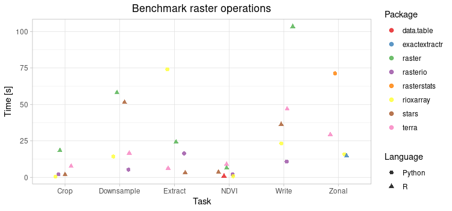

# Raster processing benchmarks
This repository contains a collection of raster processing benchmarks for Python and R packages.
The tests cover the most common operations such as loading data, extracting values by points, downsampling, calculating NDVI, writing multilayer, cropping by extent and calculating zonal statistics.
The comparison is made from the user's perspective (the simplest functions are used and the code is not optimized), so the results do not represent the best performance.



The detailed results are available at https://kadyb.github.io/raster-benchmark/report.html. 

## Software
**Python**:
- [rasterio](https://github.com/mapbox/rasterio)
- [rasterstats](https://github.com/perrygeo/python-rasterstats)
- [rioxarray](https://github.com/corteva/rioxarray)

**R**:
- [stars](https://github.com/r-spatial/stars)
- [terra](https://github.com/rspatial/terra)
- [raster](https://github.com/rspatial/raster)
- [exactextractr](https://github.com/isciences/exactextractr)

## Reproduction
1. Download raster data (851 MB) from [Google Drive](https://drive.google.com/uc?id=1lzglfQJqlQh9OWT_-czc5L0hQ1AhoR8M&export=download) or [Earth Explorer](https://earthexplorer.usgs.gov/) (original source, registration required) and then unzip to `data/`.
2. Run all benchmarks using batch script (`run_benchmarks.sh`) or single benchmarks files.

**Batch script**
```
cd raster-benchmark
./run_benchmarks.sh
```

**Single benchmark**
```
Rscript stars/crop.R
```

```
python3 rasterio/crop.py
```

## Dataset
Landsat 8 satellite scene (10 bands, 30 m resolution, 7771 x 7871 pixels) was used for tests.

Scene ID: *LC08_L1TP_190024_20200418_20200822_02_T1*

## Hardware configuration
- CPU: Intel Xeon CPU E5-2620 v2 @ 2.10GHz
- RAM: 64 GB
- OS: Pop!_OS 20.04 LTS

## Acknowledgment
Landsat-8 image courtesy of the U.S. Geological Survey, https://earthexplorer.usgs.gov/
